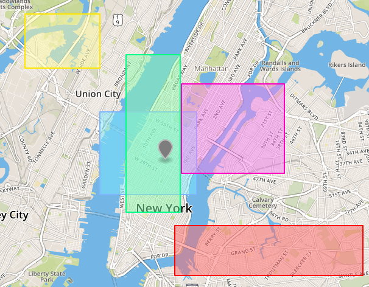

# PredExpNode Class

PredExpNode can be used to create filters for queries to exclude or include records with selected bins. Apply the filter by using methods from [AerospikeC::PredExp](predexp.md): ([#where](predexp.md#where), [#and](predexp.md#and), [#or](predexp.md#or))

Example of applying the filter:
```ruby
q_range = AerospikeC::Query.new("test", "query_test")
q_range.range!("int_bin", 5, 10)
predexp = AerospikeC::PredExp.new
predexp.where(predexp[:int_bin].eq(7))
```

With a new operation, you can use any of the methods specified below:

- [Methods](#methods)
  - [#initialize](#initialize)
  - [#eq](#eq)
  - [#not_eq](#not_eq)
  - [#gt](#gt)
  - [#gteq](#gteq)
  - [#lt](#lt)
  - [#lteq](#lteq)
  - [#regexp](#regexp)
  - [#contains](#contains)
  - [#within](#within)
  - [#not](#not)
  - [#and](#and)
  - [#or](#or)
  - [#last_update](#last_update)
  - [#expiration_time](#expiration_time)
  - [#list_and](#list_and)
  - [#list_or](#list_or)
  - [#map_key_and](#map_key_and)
  - [#map_key_or](#map_key_or)
  - [#map_val_and](#map_val_and)
  - [#map_val_or](#map_val_or)
  - [#node](#node)

<a name="methods"></a>
## Methods

<!--===============================================================================-->
<!-- initialize -->
<a name="initialize"></a>

### initialize(value)

Create a new object.

Object also can be created by using [AerospikeC::PredExp#[]](predexp.md#ary).

Providing symbol `:record` allows to filter records by [time of last update](#last_update) or [time to live](#expiration_time).

Parameters:

- `value` - value of bin - String or Symbol

Example:

```ruby
node = AerospikeC::PredExpNode.new(:int_bin)

# AerospikeC::PredExp#[]
predexp = AerospikeC::PredExp.new
predexp[:string_bin]
```

<!--===============================================================================-->
<hr/>
<!-- eq -->
<a name="eq"></a>

### eq(val)

Return all records with bin being equal to the chosen value `val`

Parameters:

- `val` - Value to compare to - accepts Integer and String

Retrun `self`

Example:

```ruby
node = AerospikeC::PredExpNode.new(:int_bin)
node.eq(5)

predexp = AerospikeC::PredExp.new
predexp[:string_bin].eq("string")
```

<!--===============================================================================-->
<hr/>
<!-- not_eq -->
<a name="not_eq"></a>

### not_eq(val)

Return all records with bin being NOT equal to the chosen value `val`

Parameters:

- `val` - Value to compare to - accepts Integer and String

Retrun `self`

Example:

```ruby
node = AerospikeC::PredExpNode.new(:int_bin)
node.not_eq(5)

predexp = AerospikeC::PredExp.new
predexp[:string_bin].not_eq("string")
```

<!--===============================================================================-->
<hr/>
<!-- gt -->
<a name="gt"></a>

### gt(val)

Return all records with bin value being greater than value `val`

Parameters:

- `val` - Value to compare to - accepts Integer

Retrun `self`

Example:

```ruby
node = AerospikeC::PredExpNode.new(:int_bin)
node.gt(5)
```

<!--===============================================================================-->
<hr/>
<!-- gteq -->
<a name="gteq"></a>

### gteq(val)

Return all records with bin value being greater or equal to value `val`

Parameters:

- `val` - Value to compare to - accepts Integer

Retrun `self`

Example:

```ruby
node = AerospikeC::PredExpNode.new(:int_bin)
node.gteq(5)
```

<!--===============================================================================-->
<hr/>
<!-- lt -->
<a name="lt"></a>

### lt(val)

Return all records with bin value being less than value `val`

Parameters:

- `val` - Value to compare to - accepts Integer

Retrun `self`

Example:

```ruby
node = AerospikeC::PredExpNode.new(:int_bin)
node.lt(5)
```

<!--===============================================================================-->
<hr/>
<!-- lteq -->
<a name="lteq"></a>

### lteq(val)

Return all records with bin value being less or equal to value `val`

Parameters:

- `val` - Value to compare to - accepts Integer

Retrun `self`

Example:

```ruby
node = AerospikeC::PredExpNode.new(:int_bin)
node.lteq(5)
```

<!--===============================================================================-->
<hr/>
<!-- regexp -->
<a name="regexp"></a>

### regexp(val)

Return all records with bin value matching regular expression in `val`

Parameters:

- `val` - Value to compare to - accepts String

Retrun `self`

Example:

```ruby
node = AerospikeC::PredExpNode.new(:string_bin)
node.regexp("hay")
```

<!--===============================================================================-->
<hr/>
<!-- contains -->
<a name="contains"></a>

### contains(val)

Return all records with bin contained in the area provided in `val`(Blue polygon):


Parameters:

- `val` - AerospikeC::GeoJson value to check

Retrun `self`

Example:

```ruby
area = AerospikeC::GeoJson.circle([20.564002990722656, 53.750943916700976], 1000)
node = AerospikeC::PredExpNode.new(:geojson_bin)
node.contains(area)
```

<!--===============================================================================-->
<hr/>
<!-- within -->
<a name="within"></a>

### within(val)

Return all records with area bin within in the point/area provided in `val`(Grey point):



Parameters:

- `val` - AerospikeC::GeoJson value to check

Retrun `self`

Example:

```ruby
point = AerospikeC::GeoJson.point(20.564002990722656, 53.750943916700976)
node = AerospikeC::PredExpNode.new(:geojson_bin)
node.within(point)
```

<!--===============================================================================-->
<hr/>
<!-- not -->
<a name="not"></a>

### not

Negates the filter.

Retrun `self`

Example:

```ruby
node = AerospikeC::PredExpNode.new(:int_bin)
node.not.eq(5) # same effect as node.not_eq(5)
```

<!--===============================================================================-->
<hr/>
<!-- and -->
<a name="and"></a>

### and(value)

Adds an "and" predicate to the filter

Parameters:

- `value` - another AerospikeC::PredExpNode

Retrun `self`

Example:

```ruby
# searches for records with 'int_bin' < 10 and 'string_bin' equal to 'foo'
node = AerospikeC::PredExpNode.new(:int_bin)
node2 = AerospikeC::PredExpNode.new(:string_bin)
node.lt(10).and(node2.eq("foo"))

# multiple nodes can be added
node.lt(10).and(node2.eq("foo")).and(node.gt(100))

```

<!--===============================================================================-->
<hr/>
<!-- or -->
<a name="or"></a>

### or(value)

Adds an "or" predicate to the filter

Parameters:

- `value` - another AerospikeC::PredExpNode

Retrun `self`

Example:

```ruby
# searches for records with 'int_bin' < 10 or 'string_bin' equal to 'foo'
node = AerospikeC::PredExpNode.new(:int_bin)
node2 = AerospikeC::PredExpNode.new(:string_bin)
node.lt(10).or(node2.eq("foo"))

# multiple nodes can be added
node.lt(10).or(node2.eq("foo")).or(node.gt(100))

```

<!--===============================================================================-->
<hr/>
<!-- last_update -->
<a name="last_update"></a>

### last_update

To use this method bin `:record` must be provided.

Search for records by the time of last update.

Provided time must be an Integer being Epoch time in nanoseconds.

Retrun `self`

Example:

```ruby
# time 10 minutes ago in nanoseconds
time = (Time.now - 10.minutes).strftime('%s%9N').to_i

# searches for records with last update time older than 10 minutes ago
node = AerospikeC::PredExpNode.new(:record)
node.last_update.lt(time)

```

<!--===============================================================================-->
<hr/>
<!-- expiration_time -->
<a name="expiration_time"></a>

### expiration_time

To use this method bin `:record` must be provided.

Search for records by the time of expiration of the record.

Provided time must be an Integer being Epoch time in nanoseconds.

Retrun `self`

Example:

```ruby
# time in 10 minutes in nanoseconds
time = (Time.now + 10.minutes).strftime('%s%9N').to_i

# searches for records which expire sooner than 10 minutes from now
node = AerospikeC::PredExpNode.new(:record)
node.expiration_time.lt(time)

```

<!--===============================================================================-->
<hr/>
<!-- list_and -->
<a name="list_and"></a>

### list_and

Search for records with selected bin being a list and all values inside it passing the filter.

Retrun `self`

Example:

```ruby
# assuming we have records:
# {"ary_bin" => [1,2,3,4,5]}
# {"ary_bin" => [3,4,5,6,7]}

node = AerospikeC::PredExpNode.new(:ary_bin)
node.list_and.lt(6) # this will return only the first record

```

<!--===============================================================================-->
<hr/>
<!-- list_or -->
<a name="list_or"></a>

### list_or

Search for records with selected bin being a list and any value inside it passing the filter.

Retrun `self`

Example:

```ruby
# assuming we have records:
# {"ary_bin" => [1,2,3,4,5]}
# {"ary_bin" => [3,4,5,6,7]}

node = AerospikeC::PredExpNode.new(:ary_bin)
node.list_or.eq(7) # this will return only the second record

```

<!--===============================================================================-->
<hr/>
<!-- map_key_or -->
<a name="map_key_or"></a>

### map_key_or

Search for records with selected bin being a mapkey(Hash) and any key inside it passing the filter.

Retrun `self`

Example:

```ruby
# assuming we have records:
# {"h_bin" => {"foo"=> "bar", "bar" => "baz"}}
# {"h_bin" => {"foo"=> "bar", "baz" => "qux"}}

node = AerospikeC::PredExpNode.new(:h_bin)
node.map_key_or.eq("bar") # this will return only the first record

```

<!--===============================================================================-->
<hr/>
<!-- map_key_and -->
<a name="map_key_and"></a>

### map_key_and

Search for records with selected bin being a mapkey(Hash) and every key inside it passing the filter.

Retrun `self`

Example:

```ruby
# assuming we have records:
# {"h_bin" => {"foo"=> "bar", "foobar" => "baz"}}
# {"h_bin" => {"foo"=> "bar", "baz" => "qux"}}

node = AerospikeC::PredExpNode.new(:h_bin)
node.map_key_and.regexp("foo") # this will return only the first record

```

<!--===============================================================================-->
<hr/>
<!-- map_val_or -->
<a name="map_val_or"></a>

### map_val_or

Search for records with selected bin being a mapkey(Hash) and any value inside it passing the filter.

Retrun `self`

Example:

```ruby
# assuming we have records:
# {"h_bin" => {"foo"=> "bar", "bar" => "baz"}}
# {"h_bin" => {"foo"=> "bar", "baz" => "qux"}}

node = AerospikeC::PredExpNode.new(:h_bin)
node.map_val_or.eq("baz") # this will return only the first record

```

<!--===============================================================================-->
<hr/>
<!-- map_val_and -->
<a name="map_val_and"></a>

### map_val_and

Search for records with selected bin being a mapkey(Hash) and all values inside it passing the filter.

Retrun `self`

Example:

```ruby
# assuming we have records:
# {"h_bin" => {"foo"=> "foobar", "bar" => "barbaz"}}
# {"h_bin" => {"foo"=> "bar", "baz" => "qux"}}

node = AerospikeC::PredExpNode.new(:h_bin)
node.map_val_and.regexp("bar") # this will return only the first record

```
